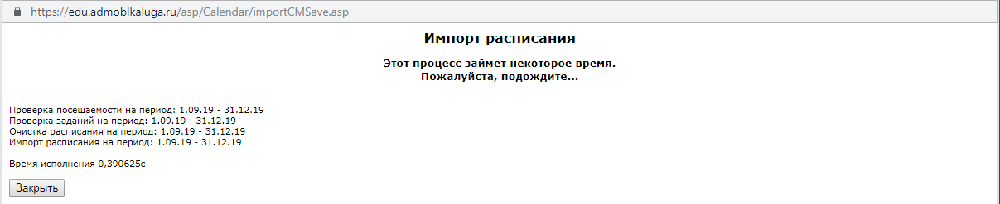

# Конвертер расписания

## Что это?
Это конвертер. Преобразует расписание формата "Хронограф.Расписание 3.0" для импорта в "Сетевой город. Образование." (.nsxml)

## Системные требования
К сожалению программа не работает на Windows XP (в отличие от Хронографа, который работает только на Windows XP)

## Как пользоваться?
  - Сконвертируйте расписание Хронографа с формат HTML
  - Скачайте файл с расписанием Сетевого города
  - Сопоставьте названия предметов Хронографа и Сетевого города

# Часть 1. Хронограф.
1. Откройте Хронограф.  

2. Перейдите на экран "Составление расписания".  

3. Нажмите отчёты --> расписание классов  

4. Настройте выгрузку как указано на скриншоте и сохраните файл.  

# Часть 2. Экспорт из Сетевого города.
1. Зайдите в Сетевой город с аккаунта, имеющего роль "Администратор".
2. Перейдите в Расписание --> Составление расписания.
3. Выберите **полную** рабочую неделю (без праздников и каникул). Это особенность Сетевого города.
4. Экспортируйте расписание из Сетевого города.  

# Часть 3. Самое главное.
(Напоминаю: программа не работает на Windows XP)
1. Открываем программу.
2. Загружаем файлы, полученные после части 1 и части 2.  

3. Нажимаем кнопку загрузить.  
    В случае ошибки, отправьте файлы из части 1 и 2 и файл error.log на _georgy.komarov@mail.ru_  
    
    **ВАЖНО**:
      - количество классов в расписании и Сетевом городе должно совпадать
      - желательно чтобы расписание было заполнено во всех классах

4. Проставьте соответствия между предметами Хронографа и Сетевого города в каждом классе.
    _(необязательно проставлять все предметы)_  
      
    
    **ВАЖНО**:
      - в 10 и 11 классах сомещённые группы (например, профильная информатика или информатика) будут отображаться в предметах "А" класса.  
    
5. После заполнения информации по всем классам нажмите кнопку "Проверить". Если в каком-либо классе будут заполнены не все поля, отобразится всплывающее окно с предупреждением.  
      
    
    **ВАЖНО**:
      - предупреждение можно игнорировать (особенно для 10 и 11 класса), кнопка сохранения станет активной в любом случае
      
6. Сохраните итоговый файл.  
  

# Часть 4. Импорт расписания в Сетевой город.
1. Зайдите в Сетевой город с аккаунта, имеющего роль "Администратор".
2. Перейдите в Расписание --> Составление расписания.
3. Выберите **полную** рабочую неделю (без праздников и каникул). Это особенность Сетевого города.
4. Нажмите кнопку "Импорт"
5. Выберите необходимый интервал.  
      
    
    **ВАЖНО**:
    В начале учебного года, когда расписание ещё "не устаканилось", **не рекомендую выбирать длинный интервал** так как:  
      * Некоторые учителя начнут заполнять ЭЖ наперёд
      * Сетевой город не сможет обновить расписание, т. к. будут проставлены отметки, ДЗ, посещаемость и т. д.
      * Придется или загружать расписание вручную, или удалять отметки, темы уроков, ДЗ.
      * А Сетевой город не покажет какой учитель и в каком классе что-то выставил. Просто выдаст ошибку.
      * Будет больно. _(знаю на своем опыте)_
    
6. Загрузите файл, полученный после части 3.  
  

7. Дождитесь окончания импорта _(в отличие от скриншота, будут выведены дни недели + уроки и точки рядом с ними, кол-во точек = кол-во уроков)_  
